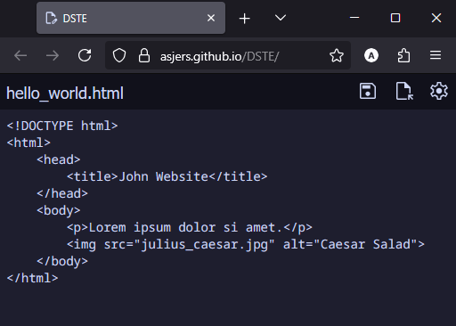
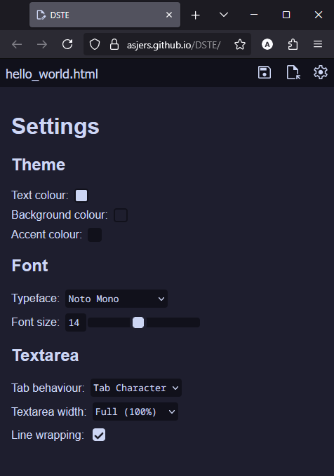

# DSTE

## Introduction

DSTE / De Skeere Text Editor (English: The Crappy Text Editor) is a text editor written in HTML made to be fully usable without internet. It's made for people that can't have professional editors like Notepad++ because they have a device managed by someone else, like a school.

The editor is also made to be highly customizable, with customizable theme colours, font sizes, tab behaviour, fonts, and even a website icon that changes colours.

### Screenshots





## Demo

You can test this applicatino without installing anything [here](https://asjers.github.io/DSTE/). This is just as a demo though, and it might not support all the features.

## Setup & Installation

Download [the DSTE package](https://minhaskamal.github.io/DownGit/#/home?url=https://github.com/AsjerS/DSTE/tree/main/package), unzip it, and open the `index.html` file to use the application. It should open the program in your default browser.

## Shortcut guide

| Action                    | Shortcut             |
|---------------------------|----------------------|
| Decrease font size        | ctrl + [             |
| Increase font size        | ctrl + ]             |
| Reset font size           | ctrl + \             |
| Save file                 | ctrl + s             |
| Load/open file            | ctrl + o             |
| Edit settings/preferences | ctrl + ,<br>ctrl + p |

## Customization

### Themes

In the `defaults.js` file, you can change some default values like theme colours and font styling. You can experiment with how colours will look in the settings menu in the application.

### Shortcuts

In the `shortcuts.js` file, you can add your own shortcuts to the app, or change what key does what. Here's how a shortcut code snippet should be made, with comments (pieces that shouldn't be in the actual code) marked with [/ comment /]:

```
...
else if (event.ctrlKey [/ use event.shiftKey and/or event.altKey if you want shift and/or alt respectively /] && event.key === 'a' [/ the key to use in combination with the initiator key(s) /]) {
    event.preventDefault();
    open_settings();; [/ here can be put the action you want the shortcut to do /]
  }
...
```

### Fonts

In the `fonts` folder, you can add your the font files you'd like to be able to select. To do this, you'll first need to add something like this at the top of the `main.css` file (comments are marked with [/ comment /]):

```
@font-face {
  font-family: 'My Font'; [/ put the name of your font here /]
  src: url('./fonts/theFilenameOfMyFont.ttf') format('truetype'); [/ put a link to the font here - the example suggests that the font is in the ./fonts folder /]
}
```

<br>

Afterwards, you need to add your font as a selectable option in the `index.html` file, at around line number 85, preferrably under `<optgroup label="NOT SAFE">`. Here's what that looks like:

```
<option class="font" value="My Font">My Font</option>
```

<br>

If you want to set the font as the default font, you can change the line `"font": "Noto Mono",` in `defaults.js` to your own font.
